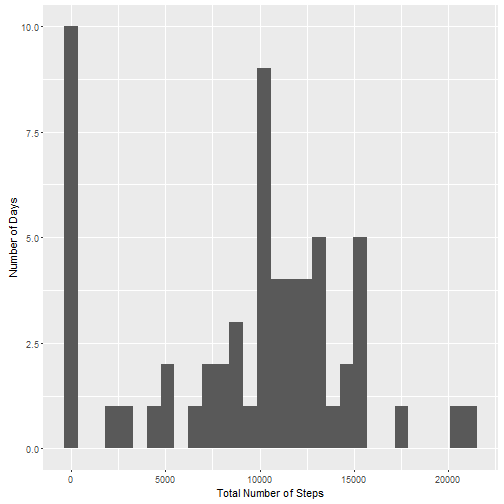
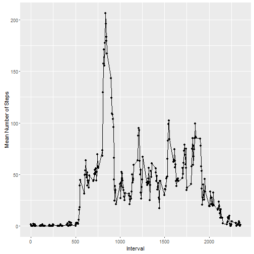
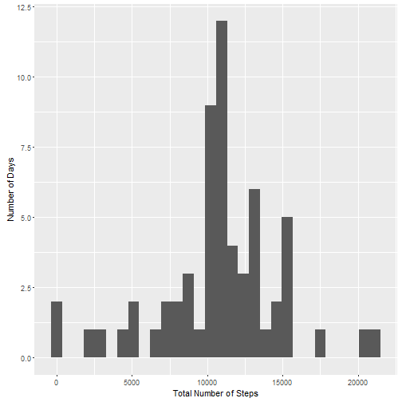
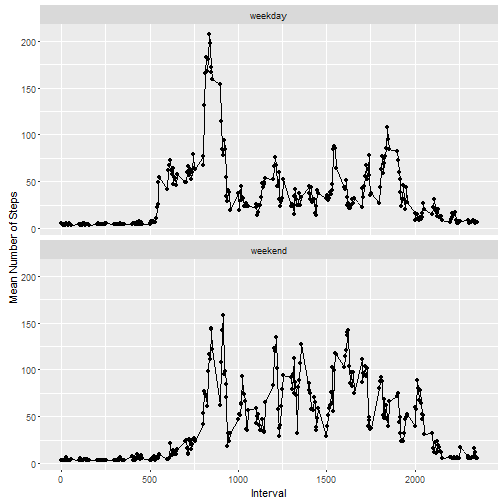

## Loading and preprocessing the data

```r
# Turn off scientific notation
options(scipen=999)
library(ggplot2)
library(dplyr)
# Load data
activity <- read.csv('activity.csv')
# Add up total number of steps for each day
per_day <- group_by(activity, date) %>% summarise(total_steps = sum(steps,na.rm=T))
per_interval <- group_by(activity, interval) %>% summarise(mean_steps = mean(steps,na.rm=T))
```

## What is mean total number of steps taken per day?

```r
ggplot(per_day, aes(total_steps)) + geom_histogram()+
  scale_x_continuous(name='Total Number of Steps')+
  scale_y_continuous(name='Number of Days')
```

```
## `stat_bin()` using `bins = 30`. Pick better value with `binwidth`.
```



```r
mean_tot <- mean(per_day$total_steps,na.rm=T)
median_tot <- median(per_day$total_steps,na.rm=T)
```
Mean total number of steps: 9354.2295082

Median total number of steps: 10395


## What is the average daily activity pattern?

```r
ggplot(per_interval, aes(interval,mean_steps)) + geom_line() + geom_point()+
  scale_x_continuous(name='Interval')+
  scale_y_continuous(name='Mean Number of Steps')
```



```r
which_interval_max = per_interval$interval[which.max(per_interval$mean_steps)]
```
Interval with maximum number of steps (averaged over days): 835


## Imputing missing values

```r
num.na <- sum(is.na(activity$steps))
```
Total number of missing values: 2304

```r
# Convert date to number for linear modeling
activity$numdate <- as.numeric(as.POSIXct(activity$date))

# Seperate NA and non-NA data
activity_nona <- subset(activity,!is.na(steps))
activity_na <- subset(activity,is.na(steps))[,c('date','interval','numdate')]

# Fit linear model to NA data using interval and day
step_model <- lm(steps~interval*numdate,data=activity_nona)

# Impute NA values with predicted values from linear model
activity_na$steps <- predict(step_model,newdata=activity_na)

# Combine imputed data and original non-NA data
imputed_activity <- as.data.frame(rbind(activity_nona,activity_na))

# Calculate per day totals for imputed data
imputed_per_day <- group_by(imputed_activity, date) %>% summarise(total_steps = sum(steps,na.rm=T))
```

```r
# Generate histogram for imputed data
ggplot(imputed_per_day, aes(total_steps)) + geom_histogram()+
  scale_x_continuous(name='Total Number of Steps')+
  scale_y_continuous(name='Number of Days')
```

```
## `stat_bin()` using `bins = 30`. Pick better value with `binwidth`.
```



```r
# Calculated summary statistics for imputed data
imp_mean_tot <- mean(imputed_per_day$total_steps,na.rm=T)
imp_median_tot <- median(imputed_per_day$total_steps,na.rm=T)

# Calculate differences between imputed and non-imputed data
imp_mean_diff <- imp_mean_tot - mean_tot
imp_median_diff <- imp_median_tot - median_tot
```
Mean total number of steps with imputation: 10767.1732944

Median total number of steps with imputation: 10781.0047294

Imputed mean - original mean: 1412.9437862

Imputed median - original median: 1412.9437862

# Impact of imputation
Imputation added a number of tokens to the center of the distribution, which dragged
the mean and median higher. This can be seen in the histogram differences, where the
original histogram had a high bar around 0, which the new histogram does not. Since
imputation involves assigning average values to NAs, it is not surprising that the 
result is a more normal distribution. Since the original distribution skewed low,
this means that the imputed data dragged the summary statistics higher.

## Are there differences in activity patterns between weekdays and weekends?

```r
imputed_activity$weekend <- factor(weekdays(as.POSIXct(imputed_activity$date)) %in% c('Saturday','Sunday'))
levels(imputed_activity$weekend)<-c('weekday','weekend')
imp_per_interval <- group_by(imputed_activity, interval, weekend) %>% summarise(mean_steps = mean(steps,na.rm=T))
```

```r
ggplot(imp_per_interval, aes(interval,mean_steps)) + geom_line() + geom_point() + facet_wrap(~weekend,ncol=1) +
  scale_x_continuous(name='Interval')+
  scale_y_continuous(name='Mean Number of Steps')
```


